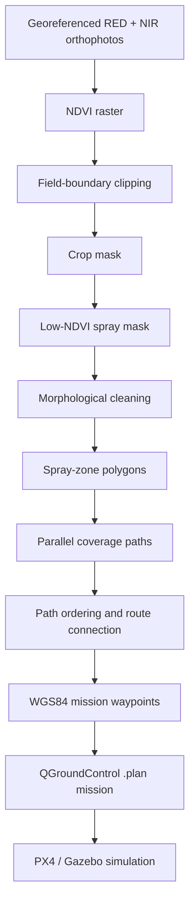
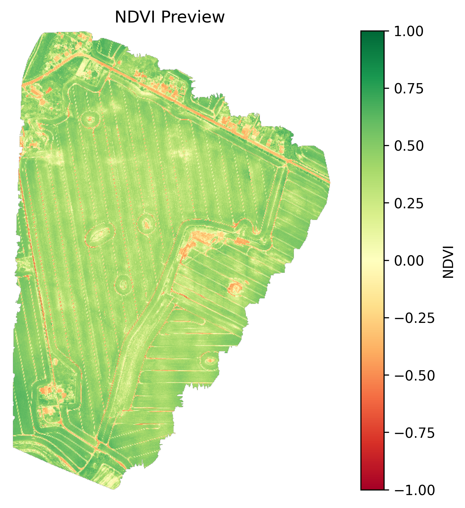
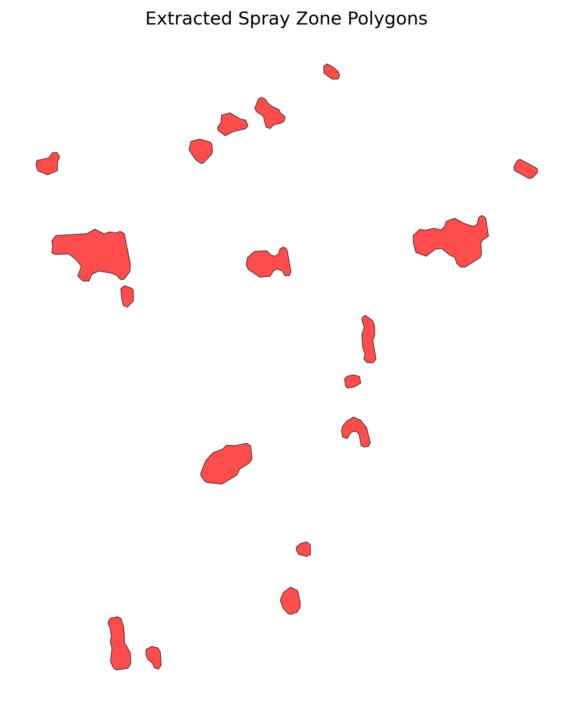
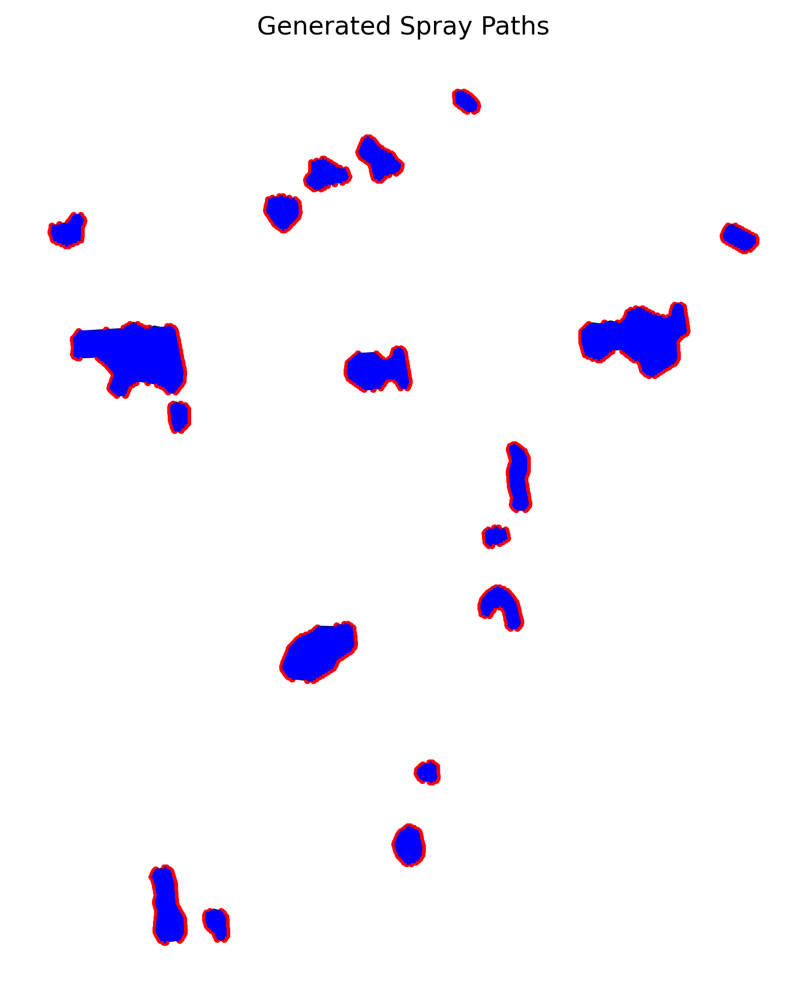
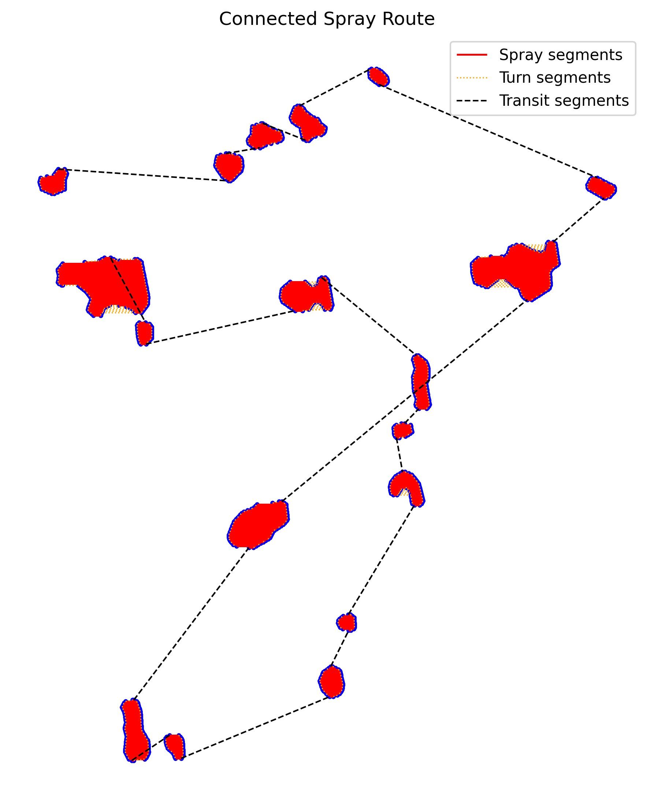

<div align="center">

# Autonomous UAV Spray Mission Planner

### From georeferenced crop-health imagery to a PX4-ready precision-spraying mission

[](https://www.python.org/)
[](https://px4.io/)
[](https://qgroundcontrol.com/)
[](LICENSE)
[](#project-status)

An open-source, menu-driven Python workflow for converting RED/NIR imagery or a georeferenced NDVI raster into targeted spray zones, coverage paths and an executable QGroundControl `.plan` mission for a PX4 multirotor.

[Quick start](#quick-start) · [Workflow](#workflow) · [Menu guide](#menu-guide) · [Example outputs](#example-outputs) · [Limitations](#limitations-and-responsible-use)

</div>

---

## Overview

Precision-spraying workflows often stop at a map showing where treatment is required. Ground-control software, however, needs flight-ready waypoints and mission commands. This project connects those stages.

The application:

- calculates NDVI from georeferenced NIR and RED orthophotos;
- clips the raster to a field boundary;
- separates crop pixels from soil and other non-crop areas;
- identifies user-defined low-NDVI treatment zones;
- cleans the binary spray mask using real-world area and distance parameters;
- converts treatment regions into spray polygons;
- generates parallel lawnmower coverage paths;
- orders separated paths using a nearest-endpoint heuristic;
- connects spray, turn and transit segments into one route;
- transforms mission coordinates to WGS84; and
- exports a PX4 multirotor mission in QGroundControl `.plan` format.

The workflow is designed for accessibility, reproducibility and further development by researchers, students and precision-agriculture practitioners.

## Key features

- **One menu, independent stages** — run the complete pipeline from `main.py`, while keeping every processing stage available as a separate Python script.
- **User-configurable treatment rules** — adjust crop and unhealthy-NDVI thresholds for the dataset and crop condition.
- **Metric geospatial processing** — specify mask-cleaning areas in square metres and distances in metres.
- **Configurable coverage paths** — control effective spray width, overlap, path angle and minimum line length.
- **Route sequencing** — begin from a compass-based reference, polygon ID, longest path or a user-supplied takeoff position.
- **Mission-aware route construction** — distinguish spray, turn and inter-polygon transit segments.
- **PX4/QGroundControl export** — create takeoff, waypoint, speed-change, optional sprayer-relay and mission-end commands.
- **Visual evidence at each stage** — save previews of the NDVI, masks, polygons, paths, ordering and connected route.
- **Safer file handling** — existing outputs are not overwritten without confirmation.

## Workflow



Raster and vector calculations remain in a projected coordinate reference system with metre units. Conversion to latitude and longitude (`EPSG:4326`) occurs only when the route is ready for mission export.

## Example outputs

| NDVI raster | Extracted spray zones |
| --- | --- |
|  |  |
| **Coverage paths** | **Connected mission route** |
|  |  |

The repository also includes an example [`spray_mission.plan`](outputs/missions/spray_mission.plan) and its human-readable [`mission-item summary`](outputs/missions/qgc_mission_items_summary.csv).

## Quick start

### 1. Clone the repository

```bash
git clone https://github.com/brightsablah/Autonomous-UAV-Spray-Mission-Planner.git
cd Autonomous-UAV-Spray-Mission-Planner
```

### 2. Create and activate a virtual environment

```bash
python -m venv .venv
```

Windows PowerShell:

```powershell
.\.venv\Scripts\Activate.ps1
```

macOS or Linux:

```bash
source .venv/bin/activate
```

### 3. Install the Python dependencies

```bash
python -m pip install --upgrade pip
python -m pip install numpy pandas matplotlib rasterio geopandas shapely pyproj scikit-image
```

### 4. Start the application

```bash
python main.py
```

Press **Enter** at any prompt to accept the value shown in square brackets.

## Input data

You may start with either RED/NIR imagery or an existing NDVI GeoTIFF.

| Input | Purpose | Main requirement |
| --- | --- | --- |
| NIR orthophoto (`.tif`) | NDVI calculation | Georeferenced data band and mask band |
| RED orthophoto (`.tif`) | NDVI calculation | Georeferenced data band and mask band; it is aligned to the NIR grid |
| NDVI raster (`.tif`) | Alternative starting point | Valid CRS, geotransform and NDVI values |
| Field boundary | Raster clipping | A valid vector file readable by GeoPandas |

Input imagery is not bundled with the repository. The menu accepts custom paths, so files do not have to use the example directory names.

> [!IMPORTANT]
> Use a projected CRS with metre units before mask cleaning, polygon extraction and path generation. WGS84 is intended for the final mission-export stage, not for area or distance calculations.

## Menu guide

```text
============================================================
AUTONOMOUS UAV SPRAY MISSION PLANNER
============================================================
1.  Inspect TIF metadata
2.  Create NDVI raster
3.  Apply field boundary
4.  Visualise TIF
5.  Create crop mask
6.  Create spray mask
7.  Clean spray mask
8.  Extract spray polygons
9.  Generate spray paths
10. Order spray paths
11. Connect ordered spray paths
12. Convert route to WGS84
13. Export QGroundControl plan
0.  Exit
```

Options 1–4 prepare and inspect the source data. Options 5–13 form the main treatment-zone and mission-planning pipeline.

| Option | Operation | Principal output |
| ---: | --- | --- |
| 1 | Inspect raster dimensions, bands, CRS, transform, bounds and statistics | Terminal report |
| 2 | Calculate NDVI and align RED data to the NIR reference grid | `data/processed/odm_ndvi.tif` |
| 3 | Clip NDVI to the selected field boundary | `data/processed/odm_ndvi_clipped_boundary.tif` |
| 4 | Display and optionally save a raster preview | PNG preview |
| 5 | Classify crop and non-crop pixels | `crop_mask_ndvi_gte_*.tif` |
| 6 | Select crop pixels within the unhealthy-NDVI interval | `spray_mask_ndvi_*_to_*.tif` |
| 7 | Remove small patches, close gaps, fill holes and remove thin features | Five intermediate cleaned masks |
| 8 | Vectorise the final mask and filter/simplify polygons | GPKG, GeoJSON and preview |
| 9 | Generate clipped parallel coverage lines and endpoints | Spray-line and waypoint GPKGs |
| 10 | Select a start and order path groups by nearest endpoints | Ordered-path GPKG, CSV and preview |
| 11 | Add turn and transit connectors to create a continuous route | Connected-route GPKG, CSV and preview |
| 12 | Transform the route and mission waypoints to WGS84 | WGS84 GPKG and waypoint CSVs |
| 13 | Build the PX4/QGroundControl mission | `.plan` file and mission-item CSV |

Every stage checks its inputs and reports common problems such as missing files, invalid thresholds, absent CRS information and unsuitable coordinate units.

## Important default parameters

The defaults reproduce the included example workflow. They are starting values, not universal agronomic or flight settings.

| Parameter | Default |
| --- | ---: |
| Minimum NDVI classified as crop | `0.00` |
| Unhealthy NDVI interval | `0.10–0.25` |
| Effective spray width | `2.0 m` |
| Spray overlap | `20%` |
| Path angle | `0°` |
| Minimum path length | `1.0 m` |
| Route starting method | South-west path |
| Relative mission altitude | `10.0 m` |
| Transit speed | `5.0 m/s` |
| Spray speed | `2.0 m/s` |
| Waypoint acceptance radius | `1.0 m` |
| Separate speed commands | Enabled |
| Sprayer relay commands | Disabled |
| Mission end action | Return to launch |

Mask-cleaning values are requested in square metres and metres. The application converts them to pixel-based values using the raster geotransform.

## QGroundControl mission export

Option 13 reads `outputs/routes/mission_waypoints_wgs84.csv` and creates:

```text
outputs/missions/
├── spray_mission.plan
└── qgc_mission_items_summary.csv
```

The exported mission can contain:

- a takeoff command;
- mission waypoints at a user-defined altitude relative to home;
- different ground-speed commands for spraying and transit;
- optional relay commands for sprayer ON/OFF control;
- return-to-launch, land or no automatic end action.

To inspect the result:

1. Open **QGroundControl** and switch to **Plan** view.
2. Open `outputs/missions/spray_mission.plan`.
3. Check the planned home position, route, altitude, speeds and end action.
4. Confirm that every waypoint lies within the intended operating area.
5. Test the mission in PX4 Software-in-the-Loop and Gazebo before considering hardware use.

Sprayer relay commands are disabled by default. Enable them only after confirming the relay index, electrical interface, failsafe behaviour and command compatibility of the intended aircraft.

## Project structure

```text
Autonomous-UAV-Spray-Mission-Planner/
├── main.py                         # Interactive menu application
├── scripts/
│   ├── setup_00_inspect_tif.py
│   ├── setup_00_create_ndvi_raster.py
│   ├── setup_00_apply_tif_boundary.py
│   ├── setup_00_visualise_tif.py
│   ├── stage1_create_ndvi_crop_mask.py
│   ├── stage2_create_ndvi_spray_mask.py
│   ├── stage3_clean_spray_mask.py
│   ├── stage4_extract_spray_polygon.py
│   ├── stage5_generate_spray_paths.py
│   ├── stage6_order_spray_paths.py
│   ├── stage7_connect_ordered_spray_paths.py
│   ├── stage8_convert_route_to_wgs84.py
│   └── stage9_export_qgroundcontrol_plan.py
├── outputs/
│   ├── figures/                    # Stage previews
│   ├── polygons/                   # Treatment-zone vectors
│   ├── paths/                      # Coverage lines and endpoints
│   ├── routes/                     # Ordered, connected and WGS84 routes
│   └── missions/                   # QGroundControl mission files
└── LICENSE
```

Advanced users can call an individual script directly. Use `--help` to see its command-line arguments:

```bash
python scripts/stage5_generate_spray_paths.py --help
python scripts/stage9_export_qgroundcontrol_plan.py --help
```

## Technical approach

### NDVI and treatment classification

NDVI is calculated as:

$$
\mathrm{NDVI} = \frac{\mathrm{NIR}-\mathrm{RED}}{\mathrm{NIR}+\mathrm{RED}}
$$

The application uses two classification stages. First, a crop threshold excludes soil and other non-crop pixels. Second, a lower and upper NDVI threshold select potential treatment areas only within the crop mask.

### Mask cleaning and vectorisation

The spray mask is refined through small-object removal, binary closing, hole filling, binary opening and final patch filtering. Connected treatment regions are then converted to valid polygon geometry and filtered by minimum area.

### Coverage and route planning

Each spray polygon is filled with parallel lines. Line spacing is calculated from effective spray width and overlap:

$$
\mathrm{spacing} = \mathrm{spray\ width}\left(1-\frac{\mathrm{overlap}}{100}\right)
$$

Separated path groups are sequenced using a nearest-endpoint heuristic. Line directions may be reversed to reduce transitions. The ordered paths are then joined with turn and transit segments to create a continuous mission route.

## Verification

The workflow has been checked through:

- raster metadata, range, nodata and spatial-alignment inspection;
- visual comparison of masks, polygons, paths and connected routes;
- geometry, area, spacing and route-continuity checks;
- successful import of the generated `.plan` file into QGroundControl; and
- PX4 Software-in-the-Loop mission execution in Gazebo.

## Limitations and responsible use

This repository is a **research prototype**, not certified flight or agricultural-application software.

- NDVI thresholds are crop-, sensor-, illumination- and site-dependent. They must be calibrated for the intended dataset.
- Where the source imagery has not been radiometrically calibrated, NDVI should be interpreted primarily as relative spatial variation rather than an absolute crop-health measurement.
- The current exporter uses a single altitude relative to the planned home position. It does not provide terrain following or obstacle avoidance.
- The nearest-endpoint method is a heuristic and does not guarantee the globally shortest route.
- Relay commands require aircraft-specific integration and ground testing.
- Users are responsible for airworthiness, risk assessment, geofencing, operator competence and compliance with local aviation, pesticide and environmental regulations.

Never fly the generated mission without reviewing it in QGroundControl and validating it in simulation for the intended aircraft, field and operating conditions.

## Project status

The core end-to-end workflow is implemented and produces a QGroundControl-compatible mission. Possible future development includes terrain-aware altitude planning, additional route-optimisation methods, automated test coverage and hardware-in-the-loop validation.

## Contributing

Issues, suggestions and pull requests are welcome. Useful contributions include:

- support for additional crop-health indices and sensor formats;
- improved path-ordering algorithms;
- terrain and obstacle-awareness;
- automated validation and regression tests; and
- support for additional autopilot mission formats.

Please open an issue before making a major change so that its scope can be discussed.

## Citation

If this repository supports your academic or research work, please cite it as:

> B. Sablah, *Autonomous UAV Spray Mission Planner*, 2026. [Online]. Available: https://github.com/brightsablah/Autonomous-UAV-Spray-Mission-Planner

```bibtex
@software{sablah2026autonomous,
  author = {Sablah, Bright},
  title  = {Autonomous UAV Spray Mission Planner},
  year   = {2026},
  url    = {https://github.com/brightsablah/Autonomous-UAV-Spray-Mission-Planner}
}
```

## Author

**Bright Sablah**  
MSc Aerospace Engineering, University of Lancashire  
[GitHub profile](https://github.com/brightsablah)

## Licence

This project is available under the [MIT Licence](LICENSE).

